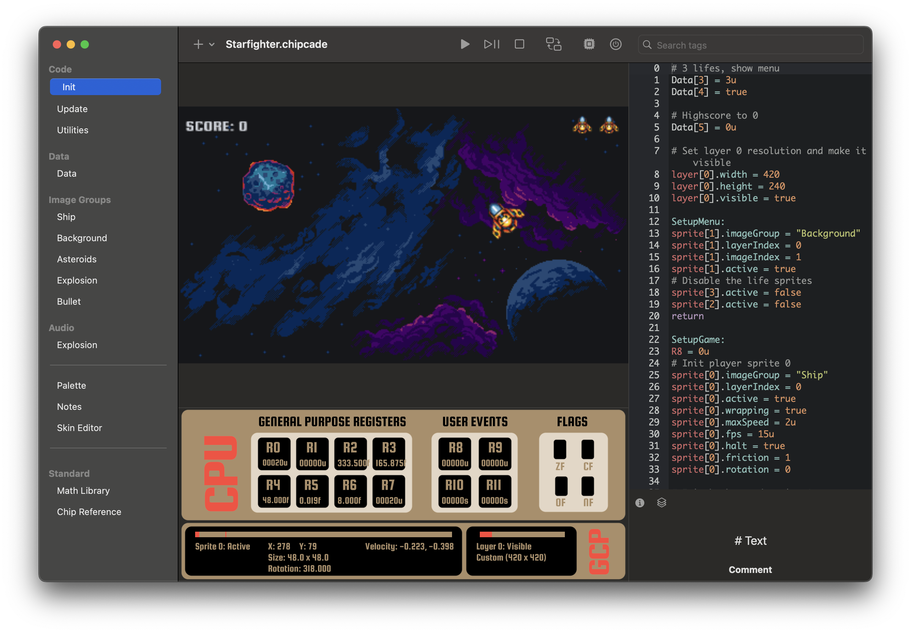

+++
archetype = "home"
title = "CHIPcade"
description = "CHIPcade is a 16-bit virtual arcade chip for macOS and iPadOS. Build retro-style games with real-time graphics, sprites, layers, and a powerful assembly-inspired scripting language."
+++

**CHIPcade** is a 16-bit retro arcade chip... or at least it thinks it is.

Program it on macOS and iPadOS to create your own classic-style games — no soldering iron required.

### Features
- Authentic* 16-bit arcade chip with 8 general-purpose registers and 4 user input registers.
- Powerful graphics co-processor with 8 layers and 255 hardware sprites.
- CHIPcade Script — a flexible, assembly-flavored scripting language.
- Built-in data sections, audio support, and customizable palette.
- Written in Swift and Metal for native performance on Apple hardware.
- Created games run on macOS, iOS, and tvOS.

\*Okay, it's all software. But your game won't know the difference.

**Coming soon** to the macOS App Store and iPad App Store.

---

